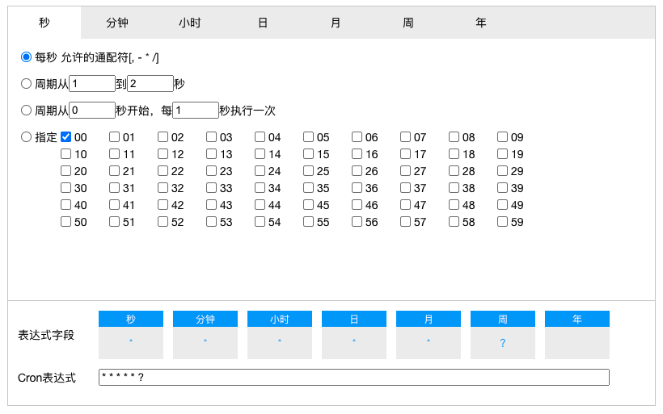

# fa-cron-react-editor
> A React cron editor

[](https://www.npmjs.com/package/fa-cron-react-editor)

# Install
```
# NPM
npm install fa-cron-react-editor

# Yarn
yarn add fa-cron-react-editor
```

# Usage
```
import { CronEditor } from 'fa-cron-react-editor';

import 'fa-cron-react-editor/dist/index.css'

function App() {
    const [cron, setCron] = useState<string>('* * * * * ?');

    return (
        <CronEditor 
            value={cron}
            onChange={setCron}
        />
    );
}
```

# Demo



